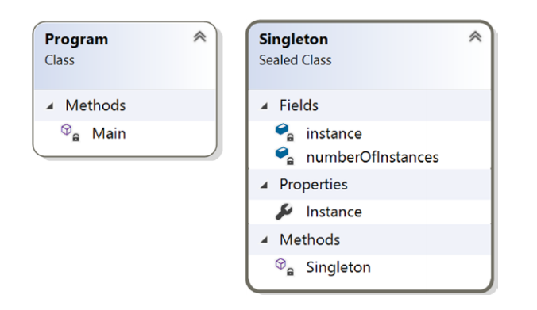

# Chapter 1: Singleton Pattern

## GoF Definition

Đảm bảo rằng một class \(lớp\) chỉ có **duy nhất** một instance \(thể hiện\), và cung cấp một nơi chung nhất, toàn cục để truy cập vào lớp đó.

## Khái niệm

Một class cụ thể chỉ nên có một instance. Bạn có thể sử dụng instance này bất cứ khi nào bạn cần làm việc với class đó và do đó sẽ tránh việc tạo thêm các đối tượng không cần thiết.

 **Giải thích:** Mẫu Singleton được sử dụng khi chúng ta muốn tạo **một và chỉ một** instance của một class xuyên suốt quá trình chạy của ứng dụng.

## Ví dụ trong đời sống thực

Giả sử bạn là thành viên trong một team thể thao và team bạn đang tham gia một giải đấu. Khi team của bạn đối đầu với team khác, theo luật, người đội trưởng của hai team sẽ tung một đồng xu. Nếu team của bạn không có đội trưởng, trước tiên team bạn cần phải bầu một ai đó làm đội trưởng. Team của bạn phải có một và chỉ một đội trưởng.

**Giải thích:** Nghĩa là trước khi tung đồng xu bạn phải có một ông làm đội trưởng \(Instance\), chưa có thì bầu ra. Ông này sẽ đại diện cho team đi tung đồng xu \(ví dụ 1 action/method nào đó của class\)

## Ví dụ chuyên ngành

Trong một số hệ thống phần mềm, bạn có thể sẽ quyết định duy trì chỉ một file system \(hệ thống quản lý tập tin\) mà bạn có thể dùng nó để quản lý một cách tập trung các resources \(tài nguyên\).

## Ví dụ từ người dịch

Bạn có một chương trình, ví dụ notepad, bạn muốn người dùng chỉ có thể mở 1 cửa sổ **duy nhất** dù họ cố mở nhiều cửa sổ như thế nào đi nữa, thì hãy xài pattern này. Nó giúp bạn ngăn không cho user mở cửa sổ thứ 2.

## Minh họa

Sau đây là một số đặc điểm chính khi triển khai:

* Constructor là private trong ví dụ này, do đó bạn sẽ không thể khởi tạo instance  như cách thông thường \(bằng từ khóa new\)
* Trước khi bạn thử tạo một instance của class, bạn sẽ kiểm tra xem liệu đã có sẵn instance nào chưa. Nếu bạn chưa có instance nào, bạn sẽ tạo mới một instance, còn không thì sử dụng cái đã có sẵn.

## Class Diagram 

Hình 1.1 Là class diagram minh họa cho mẫu Singleton



### Solution Explorer View

Hình 1.2 trình bày high-level structure \(cấu trúc bậc cao / cấu trúc chi tiết hơn\) của các thành phần trong chương trình


### Thảo luận

Ví dụ đơn giản này sẽ minh họa về khái niệm của mẫu Singleton. Phương pháp tiếp cận này gọi là _static initialization_ \(khởi tạo tĩnh\)

Ban đầu, đặc tả mẫu Singleton trong ngôn ngữ C++ có một chút không rõ ràng về thứ tự khởi tạo của những biến static \(nhớ là nguồn gốc của C\# có sự liên kết khá chặt chẽ với ngôn ngữ C và C++\). Nhưng .NET framework đã giải quyết được những vấn đề này.

Sau đây là những điểm đáng chú của phương pháp này:

* Common Language Runtime \(CLR\) sẽ phụ trách quá trình khởi tạo biến.
* Bạn tạo một instance khi bất kỳ thành viên của class được tham chiếu tới.
* _public static_ member sẽ đảm bảo có một điểm toàn cục để truy cập, nó xác nhận rằng _the instantiation process_ \(quá trình khởi tạo\) sẽ không chạy cho đến khi bạn gọi thuộc tính _**Instance**_ ****của class \(nói cách khác, nó hỗ trợ khả năng _lazy instantiation_\). Từ khóa _**sealed**_ ngăn việc dẫn xuất của lớp \(do đó các lớp con của nó sẽ không bị lạm dụng - hoặc sử dụng sai\), và từ khóa _**readonly**_ đảm bảo rằng _assignment process_ diễn ra trong lúc khởi tạo tĩnh \(static initialization\).
* Constructor là _**private**_. Do đó bạn không thể khởi tạo class Singleton bên trong hàm Main\(\). Điều này sẽ giúp bạn trỏ đến một instance có thể đã tồn tại sẵn trong hệ thống.

### Implementation

Dưới đây là code ví dụ:

```csharp
using System;

namespace SingletonPatternEx
{
    public sealed class Singleton
    {
        private static readonly Singleton instance = new Singleton();
        private int numberOfInstances = 0;

        //Private constructor có tác dụng ngăn chặn việc tạo ra 
        //các instances với từ khóa 'new' bên ngoài class
        private Singleton()
        {
            Console.WriteLine("Instantiating inside the private constructor.");
            numberOfInstances++;
            Console.WriteLine("Number of instances ={0}", numberOfInstances);
        }
        public static Singleton Instance
        {
            get
            {
                Console.WriteLine("We already have an instance now.Use it.");
                return instance;
            }
        }
    }

    class Program
    {
        static void Main(string[] args)
        {
            Console.WriteLine("***Singleton Pattern Demo***\n");
            //Console.WriteLine(Singleton.MyInt);
            // Private Constructor.So,we cannot use 'new' keyword.
            Console.WriteLine("Trying to create instance s1.");
            Singleton s1 = Singleton.Instance;
            Console.WriteLine("Trying to create instance s2.");
            Singleton s2 = Singleton.Instance;
            if (s1 == s2)
            {
                Console.WriteLine("Only one instance exists.");
            }
            else
            {
                Console.WriteLine("Different instances exist.");
            }
            Console.Read();
        }
    }
}
```

### Output

Dưới đây là kết quả sau khi chạy ví dụ

```text
***Singleton Pattern Demo***
Trying to create instance s1.
Instantiating inside the private constructor.
Number of instances =1
We already have an instance now.Use it.
Trying to create instance s2.
We already have an instance now.Use it.
Only one instance exists.
```

### Challenges

Xem xét đoạn code sau. Giả sử bạn đã thêm một dòng code \(được tô đậm\) trong class Singleton


Và method Main\(\) của bạn như vầy:

```csharp
class Program
{
    static void Main(string[] args)
    {
        Console.WriteLine("***Singleton Pattern Demo***\n");
        Console.WriteLine(Singleton.MyInt);
        Console.Read();
    }
}
```

Bây giờ khi chạy chương trình bạn sẽ thấy kết quả như sau:

```text
Number of instances =1
***Singleton Pattern Demo***
```

Điều này cho bạn thấy nhược điểm của phương pháp này. Cụ thể, bên trong hàm _Main\(\)_, bạn đã thử sử dụng biến static _**MyInt**_ nhưng chương trình của bạn vẫn tiếp tục tạo ra một instance của class Singleton. Nói cách khác, với cách tiếp cận này bạn ít kiểm soát _quá trình khởi tạo_ hơn, là cái mà chạy khi bạn refer đến bất kỳ static member nào của class.

Tùy nhiên, trong hầu hết trường hợp thì bạn không cần quan tâm đến hạn chế này, bạn có thể dễ dãi cho qua vì nó là một _one-time activity_ \(chạy một lần\) và quy trình này sẽ không bị lặp lại, do đó phương pháp này vẫn được sử dụng phổ biến trong các ứng dụng .NET

## Phần hỏi đáp

> updating...

## Tham khảo thêm

Rất có thể nội dung trong chương này \(quyển sách này\) chưa đủ để bạn hiểu, người dịch liệt kê các nguồn sau để giúp bạn tham khảo thêm:

* [http://nthoai.blogspot.com/2008/05/su-dung-singleton-trong-csharp.html](http://nthoai.blogspot.com/2008/05/su-dung-singleton-trong-csharp.html)
* [https://viblo.asia/p/hoc-singleton-pattern-trong-5-phut-4P856goOKY3](https://viblo.asia/p/hoc-singleton-pattern-trong-5-phut-4P856goOKY3)

